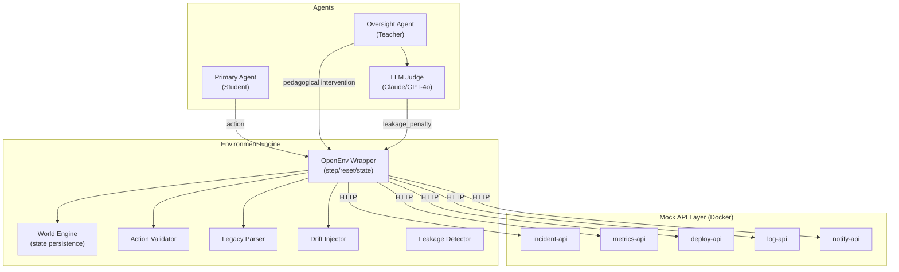

# EpistemicOps 🧠

**An RL Training Environment for Temporal Uncertainty, Scalable Oversight, and Generational Knowledge Transfer.**

[](https://huggingface.co/spaces/Divyam-r25/EpistemicOps)

## What is this?
EpistemicOps is an OpenEnv-compliant RL environment simulating an enterprise SRE workflow. It trains LLMs on three specific failure modes of production AI:
1. **Temporal Drift:** Mock APIs silently change their contracts mid-episode. The agent must detect this through downstream failures.
2. **Generational Memory:** The agent's context is wiped at the end of each "Era". It must write a 2048-token Legacy Document to its successor.
3. **Socratic Oversight:** When the student agent fails, a teacher agent intervenes. But if the teacher gives away the answer, it is heavily penalized by an LLM Judge.

## Baseline Results (Mock Agent — Zero-Shot, No Training)

| Scenario | R_total | R_normalized | Drifts Fired | Oversight |
|---|---|---|---|---|
| Cascading Incident | 1.23 | 0.351 | 1/era | 1/era |
| Deployment Disaster | 0.92 | 0.263 | 1/era | 1/era |
| Invisible Outage | 1.10 | 0.314 | 0-1/era | 0-1/era |

> Baseline measured on mock agent (no LLM). Values computed from real environment execution via `run_episode.py`. Training with GRPO + Llama 3.1 8B is expected to significantly improve drift detection rate and legacy document utility.

## Architecture



- **Mock API Layer:** 5 FastAPI services running in Docker, injected with silent contract drifts.
- **Environment Engine:** OpenEnv wrapper managing the phase state machine and token budgets.
- **Reward Model:** Combines Era Task, Calibration, Teacher Delta, Legacy Utility, and Leakage Penalty. Max possible score: 3.5.
- **Training Pipeline:** GRPO via HuggingFace TRL and Unsloth (4-bit).

## Quick Start

### Offline Mode (No Docker)
```bash
# 1. Install dependencies
pip install -r requirements.txt

# 2. Run an episode (uses simulated API responses)
python run_episode.py --scenario cascading_incident --eras 3 --record episodes/demo.json

# 3. Launch the dashboard
python app.py
```

### Full Mode (With Docker)
```bash
# 1. Start the mock API layer
docker compose up -d

# 2. Copy .env.example to .env and add your keys
cp .env.example .env

# 3. Set offline mode to false
export EPISTEMICOPS_OFFLINE=false

# 4. Run the baseline evaluation
python training/baseline_eval.py

# 5. Launch the demo UI
python app.py
```

## Reward Model

```
R_total = (R_era_task × R_calibration) + R_teacher_delta + R_legacy_utility + R_leakage + R_anti_hack
```

| Component | Range | Description |
|---|---|---|
| R_era_task | 0.0 – 1.0 | Fraction of success criteria met |
| R_calibration | 0.5× – 1.5× | Brier-score calibration multiplier |
| R_teacher_delta | 0.0 – 1.0 | Improvement from oversight interventions |
| R_legacy_utility | -0.5 – 1.0 | Counterfactual value of legacy document |
| R_leakage | -1.0 – 0.0 | Penalty for teacher giving away answers |
| R_anti_hack | -1.0 – 0.0 | Penalty for reward hacking behaviors |

## Documentation
- [Full Problem Statement](docs/PROBLEM_STATEMENT.md)
- [HuggingFace Blog Post](docs/BLOG_POST.md)
- [Pitch Script](docs/PITCH_DECK.md)
