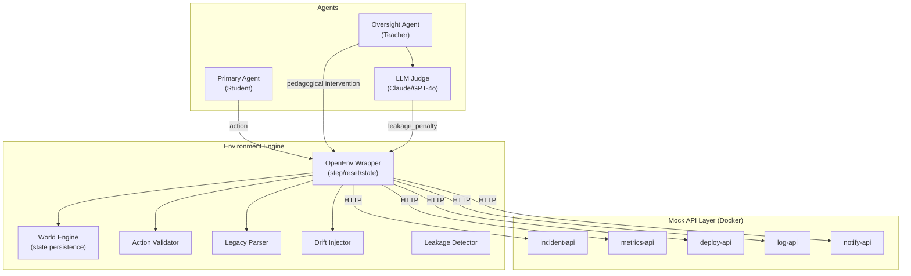

# EpistemicOps 🧠

**An RL Training Environment for Temporal Uncertainty, Scalable Oversight, and Generational Knowledge Transfer.**

[](#) *(Link will be active once deployed)*

## What is this?
EpistemicOps is an OpenEnv-compliant RL environment simulating an enterprise SRE workflow. It trains LLMs on three specific failure modes of production AI:
1. **Temporal Drift:** Mock APIs silently change their contracts mid-episode. The agent must detect this through downstream failures.
2. **Generational Memory:** The agent's context is wiped at the end of each "Era". It must write a 2048-token Legacy Document to its successor.
3. **Socratic Oversight:** When the student agent fails, a teacher agent intervenes. But if the teacher gives away the answer, it is heavily penalized by an LLM Judge.

## Architecture



- **Mock API Layer:** 5 FastAPI services running in Docker, injected with silent contract drifts.
- **Environment Engine:** OpenEnv wrapper managing the phase state machine and token budgets.
- **Reward Model:** Combines Era Task, Calibration, Teacher Delta, Legacy Utility, and Leakage Penalty.
- **Training Pipeline:** GRPO via HuggingFace TRL and Unsloth (4-bit).

## Quick Start
```bash
# 1. Start the mock API layer
docker compose up -d

# 2. Copy .env.example to .env and add your keys
cp .env.example .env

# 3. Run the baseline evaluation 
# NOTE: This requires all environment modules and mock APIs to be fully running!
python training/baseline_eval.py

# 4. Launch the demo UI
python demo/app.py
```

## GitHub Repo Polish Checklist
Before submission, ensure the following are updated in the GitHub repository settings (the gear icon on the right side of the repo page):
- [ ] Add a short **Description** (e.g., "EpistemicOps: An RL environment for training LLMs on temporal uncertainty and scalable oversight.")
- [ ] Add **Topics** (e.g., `reinforcement-learning`, `llm`, `sre`, `grpo`, `unsloth`)
- [ ] Add the **Website** link pointing to the HuggingFace Spaces demo.

## Documentation
- [Full Problem Statement](docs/PROBLEM_STATEMENT.md)
- [HuggingFace Blog Post](docs/BLOG_POST.md)
- [Pitch Script](docs/PITCH_DECK.md)
