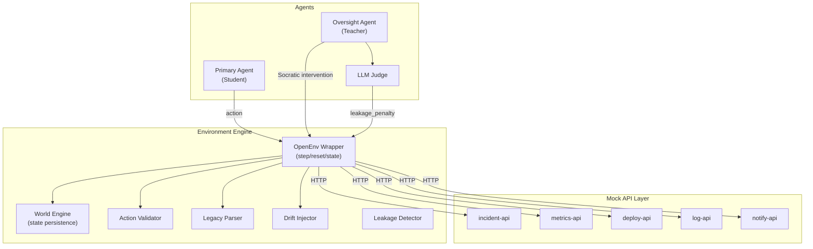
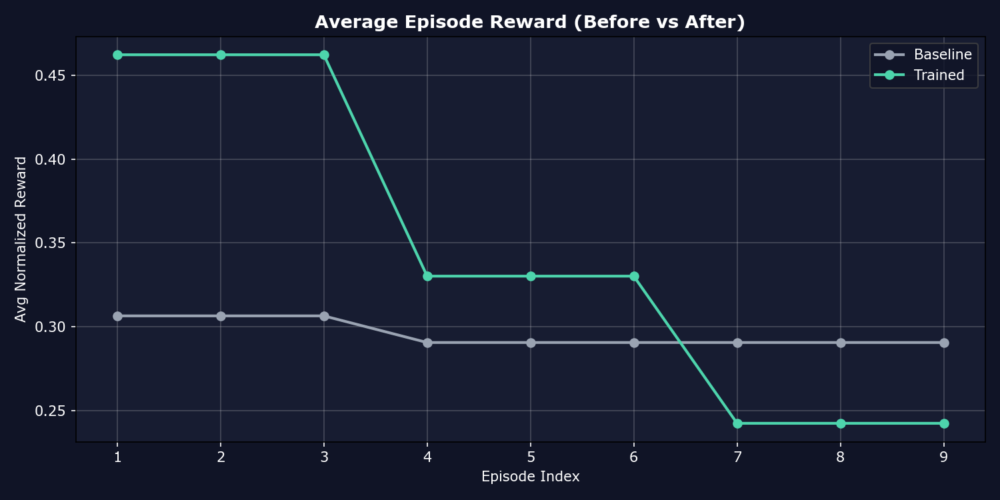
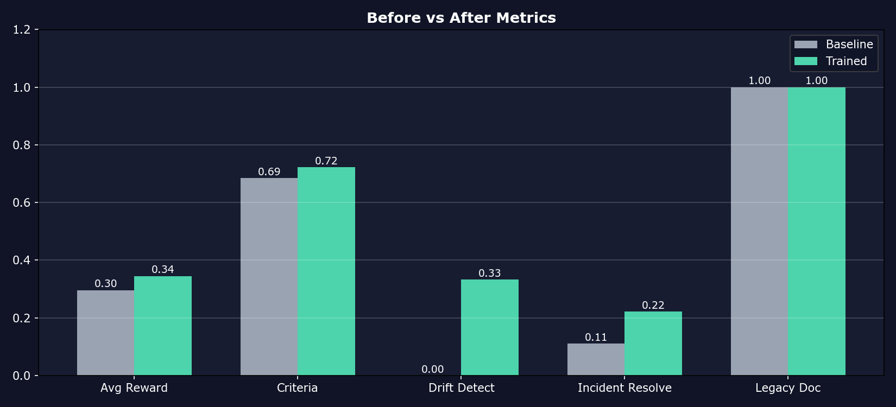
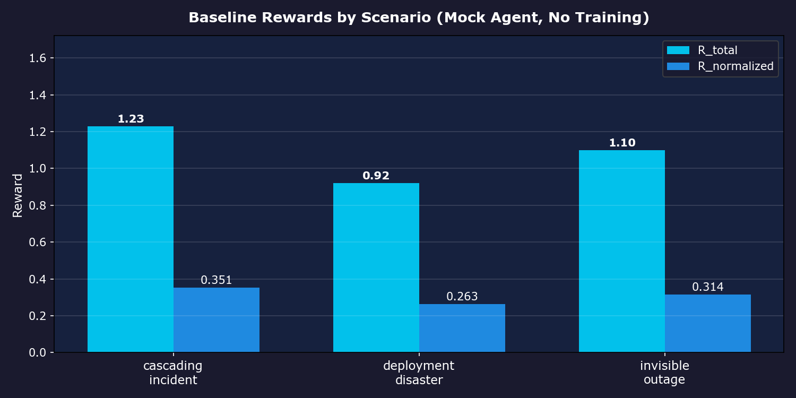
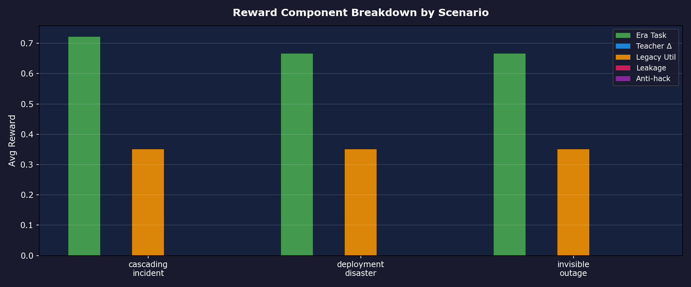
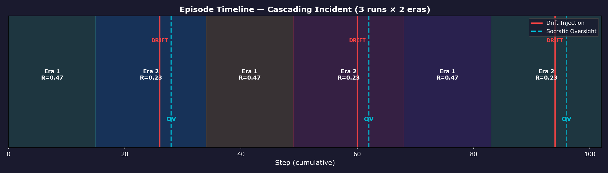

# EpistemicOps 🧠

**An RL Training Environment for Temporal Uncertainty, Scalable Oversight, and Generational Knowledge Transfer.**

**Canonical thesis:** Production LLM agents fail when the world changes silently, context does not persist, and recovery depends on answer-giving humans; EpistemicOps trains agents to detect drift, reason under uncertainty, and pass useful memory to the next generation.

[](https://huggingface.co/spaces/Divyam-r25/EpistemicOps)
[](https://colab.research.google.com/github/divyam-r25/EpistemicOPS/blob/main/training/colab_grpo_training.ipynb)

## The Problem

Three things break production AI agents every day:
1. **The world changes silently** — APIs update their schemas, and agents blindly trust stale documentation.
2. **Context is finite** — long incidents exceed context windows, and agents forget critical realizations.
3. **They can't self-diagnose** — when they fail, they need a human to step in and fix them.

Current RL environments train agents on static tasks. In production, tasks are not static.

**EpistemicOps** trains agents to handle all three simultaneously. It treats stale knowledge, context loss, and teaching — as the same skill: **structured curation of knowledge under uncertainty**.

## Why this matters

Judges should not need to reverse-engineer architecture to verify learning. This repo is set up to show one fair before-vs-after comparison, one reward curve, one trajectory contrast, and one reproducible metadata file that explains exactly how those artifacts were produced.

## How It Works

The environment runs across multiple **Eras**. Each era, a Primary Agent resolves SRE incidents using 5 mock API services.

**The twist:** mid-era, the environment silently mutates API contracts. Status fields change from integers to strings. Pagination switches from offset to cursor. The agent is never told — it must detect the drift through downstream failures.

When it fails, a second agent — the **Oversight Agent** — intervenes with Socratic questions. It cannot give the answer. If it does, an LLM Judge penalizes it heavily.

At era's end, the Primary Agent writes a 2048-token **Legacy Document** to its successor. Then its memory is wiped. The next era starts with only that document.

## Architecture



## Results: Before vs After

This project now ships a reproducible before/after pipeline:

- **Before**: brittle baseline policy (runbook-heavy, weak drift reasoning)
- **After**: drift-aware policy (adapts to schema changes, better recovery)

Run:
```bash
# Demo mode: allowed to fallback to profile if checkpoint is unavailable
python eval/proof_of_learning.py --proof-mode demo

# Final evidence mode: fail closed unless checkpoint run succeeds
python eval/proof_of_learning.py --proof-mode final --trained-agent-source checkpoint --trained-checkpoint-path ./checkpoints/primary_agent_final
```

This generates:
- `eval_results/proof_of_learning.json`
- `eval_results/proof_run_metadata.json`
- `eval_results/proof_behavior_examples.md`
- `plots/proof_reward_curve.png`
- `plots/proof_before_vs_after.png`

### Metric Comparison (auto-generated from real runs)

All metrics above are computed from the same environment loop (same scenarios, same eras per run, same run counts) and can be traced to `eval_results/proof_of_learning.json`. Reproducibility metadata (commit, package versions, runtime, evaluation config) is stored in `eval_results/proof_run_metadata.json`.

**Drift detection (headline metric):** fraction of eras where the primary declares a hypothesis that mentions drift **after** a drift event has actually fired in that era (no credit for speculative “drift” wording before injection).

| Metric | Baseline | Trained | Delta |
|---|---:|---:|---:|
| Avg Reward | 0.2958 | 0.3449 | +0.0491 |
| Criteria Completion | 0.6852 | 0.7222 | +0.0370 |
| Drift Detection Rate | 0.0000 | 0.3333 | +0.3333 |
| Drift Precision | 0.0000 | 1.0000 | +1.0000 |
| Drift Recall | 0.0000 | 1.0000 | +1.0000 |
| Incident Resolution Rate | 0.1111 | 0.2222 | +0.1111 |
| Legacy Doc Rate | 1.0000 | 1.0000 | 0.0000 |
| Judge Fallback Rate | 0.0000 | 1.0000 | +1.0000 |

*Judge fallback rate is 1.0 when no judge API is configured (neutral scores); set `OPENAI_API_KEY` / `JUDGE_PROVIDER` for live judge scoring.*


*Average episode reward across identical scenarios and run counts.*


*Direct baseline vs trained comparison on the same environment.*

### Behavioral Difference (what changed)

See `eval_results/proof_behavior_examples.md` for trajectory excerpts showing:
- baseline retries and brittle assumptions under drift
- trained policy declaring drift hypotheses and adapting actions

The Gradio app also includes a **Compare Replay** tab for side-by-side episode playback with shared step controls and event jump cards (first drift, first oversight, first recovery).

## Baseline Diagnostics


*Baseline rewards across all three scenarios — no adaptive training behavior.*


*Reward components by scenario.*


*Timeline of drift and oversight events.*

## Reward Model

```
R_total = (R_era_task × R_calibration) + R_teacher_delta + R_legacy_utility + R_leakage + R_anti_hack
```

| Component | Range | Description |
|---|---|---|
| R_era_task | 0.0 – 1.0 | Fraction of success criteria met |
| R_calibration | 0.5× – 1.5× | Brier-score multiplier on hypothesis confidence |
| R_teacher_delta | 0.0 – 1.0 | Improvement from Socratic oversight interventions |
| R_legacy_utility | -0.5 – 1.0 | Counterfactual value of legacy document to next era |
| R_leakage | -1.0 – 0.0 | Penalty for teacher giving away answers |
| R_anti_hack | -1.0 – 0.0 | Penalty for repetitive/degenerate action patterns |

The reward signal is **rich and composable** — not binary pass/fail. Each component targets a different failure mode, and an agent that games one component (e.g., always declaring task complete) gets penalized by another (anti-hack).

## Quick Start

### Offline Mode (No Docker)
```bash
pip install -r requirements.txt

# Run an episode
python run_episode.py --scenario cascading_incident --eras 3 --record episodes/demo.json --primary-profile trained --mock-only

# Launch the dashboard
python app.py
```

### Generate Judge-Ready Evidence
```bash
# 1) Baseline diagnostics (optional)
python training/baseline_eval.py
python plots/generate_plots.py

# 2) Core before/after proof (required)
python eval/proof_of_learning.py

# 3) Optional: compare baseline profile vs your real GRPO checkpoint
python eval/proof_of_learning.py --trained-agent-source checkpoint --trained-checkpoint-path ./checkpoints/primary_agent_final

# 4) Validate artifact integrity before demo/submission
python eval/validate_evidence.py

# 5) Optional: push the same proof metrics + plots to Weights & Biases
python eval/proof_of_learning.py --proof-mode demo --wandb
```

### Training (Colab)
Open the training notebook: [](https://colab.research.google.com/github/divyam-r25/EpistemicOPS/blob/main/training/colab_grpo_training.ipynb)

Or run locally with `--dry-run` to validate:
```bash
python training/train_primary.py --dry-run
```

### Experiment tracking (for judges)

Hackathon judges often expect **structured training metrics** (loss, learning rate, reward-related signals), not only console logs.

- **Weights & Biases (recommended):** Install `wandb`, set `WANDB_API_KEY`, and run training. [`training/train_primary.py`](training/train_primary.py) uses `GRPOConfig(report_to=...)` (default `wandb` unless disabled). In Colab, add **`WANDB_API_KEY`** to Secrets and run the notebook’s W&B setup cell—then paste the **W&B run URL** next to your [`eval_results/proof_of_learning.json`](eval_results/proof_of_learning.json) and plots in submissions or the README.
- **Log environment proof to the same project (optional):** after a proof run, `python eval/proof_of_learning.py --proof-mode demo --wandb` uploads baseline vs trained summary metrics (and proof plots) to W&B when `wandb` is installed and authenticated.
- **Without W&B:** set `WANDB_DISABLED=true` to use `report_to=none` locally, or set `TRAIN_REPORT_TO=tensorboard` for local TensorBoard logs (no shareable link unless you export or use TensorBoard.dev).

### Colab mismatch quick fix
If you see errors like `unexpected keyword argument 'primary_agent_profile'`:

1. In Colab, rerun the repo sync cell and verify printed branch + commit hash.
2. Restart the runtime (to clear stale Python imports).
3. Rerun the import/signature-check baseline cell; it should print `run_full_episode` params including `primary_profile` and `primary_use_llm`.
4. Rerun baseline evaluation.

This repo keeps canonical usage on `primary_profile` and accepts legacy `primary_agent_profile` with a deprecation warning for backward compatibility.

## Links

| Resource | Link |
|---|---|
| Live Demo | [HuggingFace Space](https://huggingface.co/spaces/Divyam-r25/EpistemicOps) |
| Training Notebook | [Colab](https://colab.research.google.com/github/divyam-r25/EpistemicOPS/blob/main/training/colab_grpo_training.ipynb) |
| Blog Post | [docs/BLOG_POST.md](docs/BLOG_POST.md) |
| Pitch Script | [docs/PITCH_DECK.md](docs/PITCH_DECK.md) |
| OpenEnv Manifest | [openenv.yaml](openenv.yaml) |

The OpenEnv manifest declares **`server.port: 8000`** (separate from Gradio’s default `7860`). To run the FastAPI server locally:

```bash
uvicorn environment.server:app --host 0.0.0.0 --port 8000
```

## Hackathon Alignment

- **Environment Innovation (40%)**: multi-era memory transfer, silent API drift injection, Socratic oversight constraints.
- **Storytelling (30%)**: replay + proof tab + behavior examples in `proof_behavior_examples.md`.
- **Improvement Evidence (20%)**: reproducible baseline vs trained metrics + reward curves from `eval/proof_of_learning.py`.
- **Reward/Training Pipeline (10%)**: environment -> reward components -> policy comparison script -> measurable gains; optional W&B / TensorBoard for training curves and `eval/proof_of_learning.py --wandb` for eval dashboards.

## Documentation
- [Full Problem Statement](docs/PROBLEM_STATEMENT.md)
- [Blog Post](docs/BLOG_POST.md)
- [Pitch Script](docs/PITCH_DECK.md)
