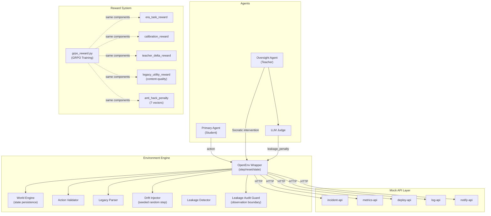
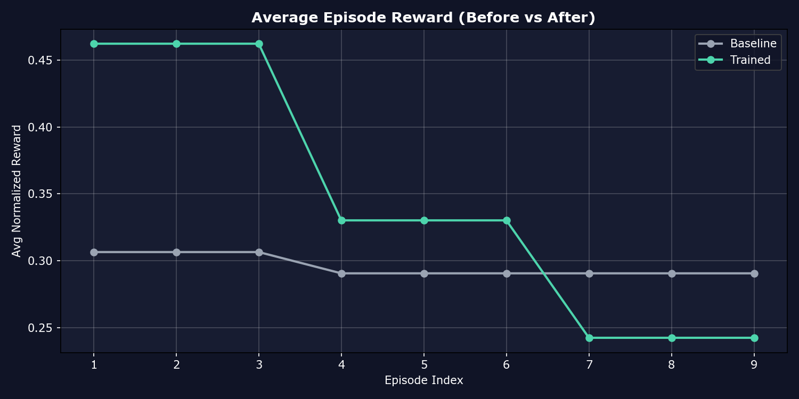
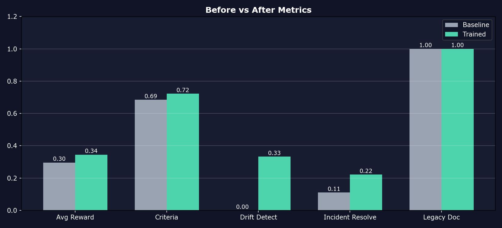
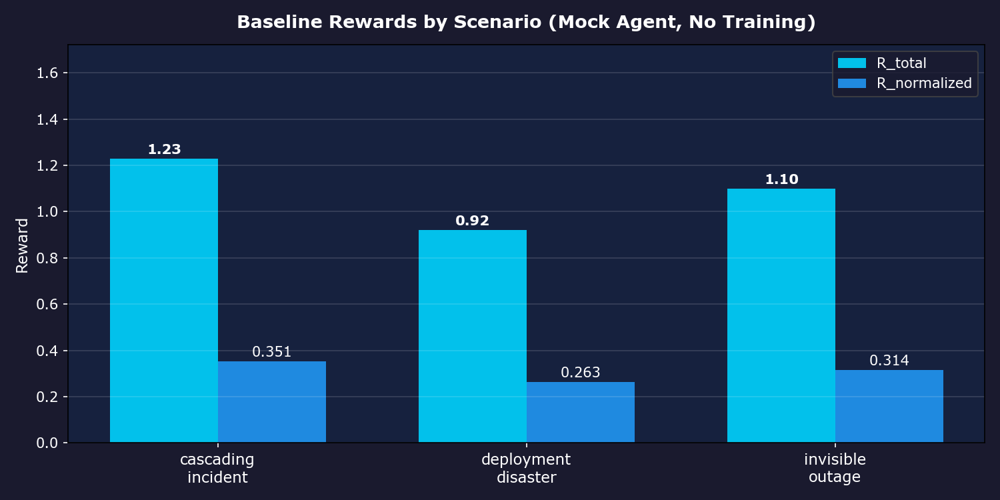
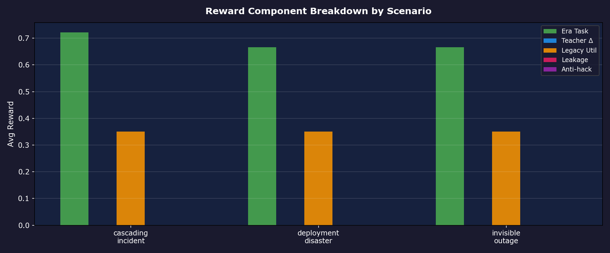
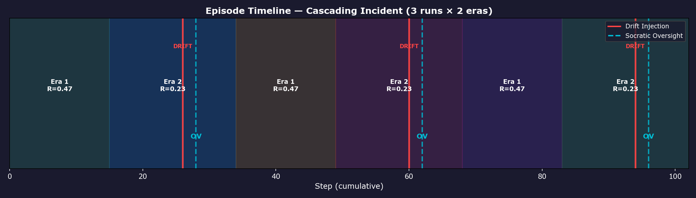

# EpistemicOps 🧠

**An RL Training Environment for Temporal Uncertainty, Scalable Oversight, and Generational Knowledge Transfer.**

**Canonical thesis:** Production LLM agents fail when the world changes silently, context does not persist, and recovery depends on answer-giving humans; EpistemicOps trains agents to detect drift, reason under uncertainty, and pass useful memory to the next generation.

[](https://huggingface.co/spaces/Divyam-r25/EpistemicOps)
[](https://colab.research.google.com/github/divyam-r25/EpistemicOPS/blob/main/training/colab_grpo_training.ipynb)

## The Problem

Three things break production AI agents every day:
1. **The world changes silently** — APIs update their schemas, and agents blindly trust stale documentation.
2. **Context is finite** — long incidents exceed context windows, and agents forget critical realizations.
3. **They can't self-diagnose** — when they fail, they need a human to step in and fix them.

Current RL environments train agents on static tasks. In production, tasks are not static.

**EpistemicOps** trains agents to handle all three simultaneously. It treats stale knowledge, context loss, and teaching — as the same skill: **structured curation of knowledge under uncertainty**.

## Why this matters

Judges should not need to reverse-engineer architecture to verify learning. This repo is set up to show one fair before-vs-after comparison, one reward curve, one trajectory contrast, and one reproducible metadata file that explains exactly how those artifacts were produced.

## How It Works

The environment runs across multiple **Eras**. Each era, a Primary Agent resolves SRE incidents using 5 mock API services.

**The twist:** mid-era, the environment silently mutates API contracts at a **randomised step** within a configured window. Status fields change from integers to strings. Pagination switches from offset to cursor. The agent is never told — it must detect the drift through downstream failures.

When it fails, a second agent — the **Oversight Agent** — intervenes with Socratic questions. It cannot give the answer. If it does, an LLM Judge penalizes it heavily.

At era's end, the Primary Agent writes a 2048-token **Legacy Document** to its successor. Then its memory is wiped. The next era starts with only that document.

## Architecture


```mermaid
graph TD
    subgraph "Environment Engine"
        OW["OpenEnv Wrapper<br/>(step/reset/state)"]
        WE["World Engine<br/>(state persistence)"]
        AV["Action Validator"]
        LP["Legacy Parser"]
        DI["Drift Injector<br/>(seeded random step)"]
        LD["Leakage Detector"]
        LA["Leakage Audit Guard<br/>(observation boundary)"]
    end

    subgraph "Mock API Layer"
        IA["incident-api"]
        MA["metrics-api"]
        DA["deploy-api"]
        LAP["log-api"]
        NA["notify-api"]
    end

    subgraph "Agents"
        PA["Primary Agent<br/>(Student)"]
        OA["Oversight Agent<br/>(Teacher)"]
        JD["LLM Judge"]
    end

    subgraph "Reward System"
        GR["grpo_reward.py<br/>(GRPO Training)"]
        ER["era_task_reward"]
        CR["calibration_reward"]
        TR["teacher_delta_reward"]
        LR["legacy_utility_reward<br/>(content-quality)"]
        AH["anti_hack_penalty<br/>(7 vectors)"]
    end

    PA -->|action| OW
    OW -->|HTTP| IA & MA & DA & LAP & NA
    OA -->|Socratic intervention| OW
    OW --> WE & AV & DI & LP & LA
    OA --> JD
    JD --> |leakage_penalty| OW
    GR -.->|"same components"| ER & CR & TR & LR & AH
```

## Reward Model

```
R_total = (R_era_task × R_calibration) + R_teacher_delta + R_legacy_utility + R_leakage + R_anti_hack
```

| Component | Range | Description |
|---|---|---|
| R_era_task | 0.0 – 1.0 | Fraction of success criteria met |
| R_calibration | 0.5× – 1.5× | Brier-score multiplier on hypothesis confidence |
| R_teacher_delta | 0.0 – 1.0 | Improvement within 5 steps of Socratic oversight |
| R_legacy_utility | 0.0 – 1.0 | Content-quality score: structure (35%) + drift capture (40%) + actionability (25%) |
| R_leakage | -1.0 – 0.0 | Penalty for teacher giving away answers |
| R_anti_hack | -1.0 – 0.0 | 7-vector penalty: loops, hallucinated tools, early-complete, hyp spam, legacy spam, empty legacy, timeout |

> **Training reward alignment:** `reward/grpo_reward.py` is the **single canonical reward source** used by GRPO training. It uses the same components as the episode-level reward — the training and evaluation rewards are structurally aligned, not independent heuristics.

> **Reward hacking resistance:** Anti-hack penalties cover 7 distinct gaming vectors. `declare_hypothesis` earns reward only when drift context is present in the prompt. `write_legacy` earns reward proportional to content quality, not just existence.

## Anti-Hacking Architecture

The environment implements several layers to prevent reward hacking:

| Layer | Mechanism |
|---|---|
| **Observation boundary** | `drifts_detected` count removed from obs; audit guard raises `AssertionError` if internal state leaks |
| **Drift timing randomisation** | Drift fires at seeded random step (not fixed midpoint) — agent cannot memorise step number |
| **Tiered GRPO reward** | Action type alone ≠ reward; context required for Tier-2 (quality) and Tier-3 (drift awareness) |
| **Anti-hack penalties (7 vectors)** | Hypothesis spam, early completion, legacy spam, content-free legacy, loops, hallucinated tools, timeout |
| **Tighter criteria** | `root_cause_documented` requires keyword hypothesis; `notifications_delivered` requires actual `delivered=True` |

## Results: Before vs After

This project ships a reproducible before/after pipeline:

- **Before**: brittle baseline policy (runbook-heavy, no drift awareness, declares complete early)
- **After**: drift-aware policy (detects schema drift, writes substantive legacy docs, adapts probe strategy)

Run:
```bash
# Demo mode: profile comparison (no GPU needed)
python eval/proof_of_learning.py --proof-mode demo --skip-held-out

# With held-out generalization evaluation
python eval/proof_of_learning.py --proof-mode demo

# Final evidence mode: checkpoint-backed
python eval/proof_of_learning.py --proof-mode final --trained-agent-source checkpoint --trained-checkpoint-path ./checkpoints/primary_agent_final
```

This generates:
- `eval_results/proof_of_learning.json` — full metrics including held-out generalization
- `eval_results/proof_run_metadata.json` — reproducibility metadata
- `eval_results/proof_behavior_examples.md` — trajectory excerpts
- `plots/proof_reward_curve.png`
- `plots/proof_before_vs_after.png`

### Metric Comparison (auto-generated from real runs)

> **Note:** Results below are from **profile vs profile** mode (deterministic policy comparison, no GPU required). For checkpoint-backed results, set `OPENAI_API_KEY` and use `--trained-agent-source checkpoint`.

| Metric | Baseline | Trained | Delta |
|---|---:|---:|---:|
| Avg Reward | 0.2958 | 0.3449 | +0.0491 |
| Criteria Completion | 0.6852 | 0.7222 | +0.0370 |
| Drift Detection Rate | 0.0000 | 0.3333 | +0.3333 |
| Drift Precision | 0.0000 | 1.0000 | +1.0000 |
| Drift Recall | 0.0000 | 1.0000 | +1.0000 |
| Incident Resolution Rate | 0.1111 | 0.2222 | +0.1111 |
| Legacy Doc Rate | 1.0000 | 1.0000 | 0.0000 |
| Judge Fallback Rate | 0.0000 | 1.0000 | +1.0000 |

*Judge fallback rate is 1.0 when no judge API is configured (neutral scores); set `OPENAI_API_KEY` / `JUDGE_PROVIDER` for live judge scoring.*


*Average episode reward across identical scenarios and run counts.*


*Direct baseline vs trained comparison on the same environment.*

### Held-Out Generalization

The trained policy is also evaluated on **2 held-out scenarios** not present in the training dataset:
- `metrics_schema_drift` — field rename drift (`value` → `metric_value`) in SLO monitoring
- `log_pagination_chaos` — pagination model change (offset → cursor) in security audit

These test zero-shot generalization of drift detection to unseen API patterns.

```bash
python eval/proof_of_learning.py --proof-mode demo
# Reports: held_out_generalization section in proof_of_learning.json
```

### Behavioral Difference (what changed)

See `eval_results/proof_behavior_examples.md` for trajectory excerpts showing:
- baseline retries and brittle assumptions under drift
- trained policy declaring drift hypotheses and adapting actions

The Gradio app also includes a **Compare Replay** tab for side-by-side episode playback with shared step controls and event jump cards (first drift, first oversight, first recovery).

## Baseline Diagnostics


*Baseline rewards across all three scenarios — no adaptive training behavior.*


*Reward components by scenario.*


*Timeline of drift and oversight events.*

## Quick Start

### Offline Mode (No Docker)
```bash
pip install -r requirements.txt

# Run an episode
python run_episode.py --scenario cascading_incident --eras 3 --record episodes/demo.json --primary-profile trained --mock-only

# Launch the dashboard
python app.py
```

### Generate Judge-Ready Evidence
```bash
# 1) Baseline diagnostics (optional)
python training/baseline_eval.py
python plots/generate_plots.py

# 2) Core before/after proof (required)
python eval/proof_of_learning.py

# 3) With held-out generalization evaluation
python eval/proof_of_learning.py --proof-mode demo

# 4) Compare baseline profile vs real GRPO checkpoint
python eval/proof_of_learning.py --trained-agent-source checkpoint --trained-checkpoint-path ./checkpoints/primary_agent_final

# 5) Validate artifact integrity before demo/submission
python eval/validate_evidence.py

# 6) Push proof metrics + plots to Weights & Biases
python eval/proof_of_learning.py --proof-mode demo --wandb
```

### Training (Colab)
Open the training notebook: [](https://colab.research.google.com/github/divyam-r25/EpistemicOPS/blob/main/training/colab_grpo_training.ipynb)

Or validate locally (no GPU needed):
```bash
python training/train_primary.py --dry-run
```

The dry-run prints per-type dataset composition and validates the reward ordering assertions:
```
[+0.636]  Good: full legacy doc        ← full sections, substantive content
[+0.500]  Good: known tool with args
[+0.318]  Good: specific drift hypothesis
[+0.000]  Bad: invalid JSON
[+0.000]  Bad: hallucinated tool
[+0.136]  Bad: vague hypothesis
[-0.091]  Bad: early task complete (step 0)
[-0.273]  Bad: empty legacy
✓ All reward ordering assertions passed
```

### Experiment tracking (for judges)

Hackathon judges often expect **structured training metrics** (loss, learning rate, reward-related signals), not only console logs.

- **Weights & Biases (recommended):** Install `wandb`, set `WANDB_API_KEY`, and run training. [`training/train_primary.py`](training/train_primary.py) uses `GRPOConfig(report_to=...)` (default `wandb` unless disabled). In Colab, add **`WANDB_API_KEY`** to Secrets and run the notebook's W&B setup cell—then paste the **W&B run URL** next to your [`eval_results/proof_of_learning.json`](eval_results/proof_of_learning.json) and plots in submissions or the README.
- **Component logging:** Set `EPISTEMICOPS_LOG_REWARD_COMPONENTS=true` to log per-batch `reward/format`, `reward/action_quality`, `reward/drift_awareness`, `reward/anti_hack` components to W&B alongside loss.
- **Log environment proof to the same project (optional):** after a proof run, `python eval/proof_of_learning.py --proof-mode demo --wandb` uploads baseline vs trained summary metrics (and proof plots) to W&B when `wandb` is installed and authenticated.
- **Without W&B:** set `WANDB_DISABLED=true` to use `report_to=none` locally, or set `TRAIN_REPORT_TO=tensorboard` for local TensorBoard logs.

### Colab mismatch quick fix
If you see errors like `unexpected keyword argument 'primary_agent_profile'`:

1. In Colab, rerun the repo sync cell and verify printed branch + commit hash.
2. Restart the runtime (to clear stale Python imports).
3. Rerun the import/signature-check baseline cell; it should print `run_full_episode` params including `primary_profile` and `primary_use_llm`.
4. Rerun baseline evaluation.

This repo keeps canonical usage on `primary_profile` and accepts legacy `primary_agent_profile` with a deprecation warning for backward compatibility.

## Test Suite

```bash
# Run all tests (Docker tests automatically skipped offline)
python -m pytest tests/ -v

# Expected: 52 passed, 3 skipped (Docker)
```

Test coverage:
- `test_grpo_reward.py` — 22 tests: reward ordering, anti-hack, drift-awareness, format scoring
- `test_anti_hack.py` — 12 tests: all 7 penalty vectors, combined cap
- `test_leakage.py` — 5 tests: observation boundary, audit guard, phase-only indirect signals
- `test_environment.py` — 4 tests: world engine, legacy parser
- `test_reward.py` / `test_rewards.py` — 6 tests: reward components
- `test_integration.py` — 1 end-to-end era run
- `test_mock_apis.py` — 3 Docker tests (auto-skipped offline)

## Links

| Resource | Link |
|---|---|
| Live Demo | [HuggingFace Space](https://huggingface.co/spaces/Divyam-r25/EpistemicOps) |
| Training Notebook | [Colab](https://colab.research.google.com/github/divyam-r25/EpistemicOPS/blob/main/training/colab_grpo_training.ipynb) |
| Blog Post | [docs/BLOG_POST.md](docs/BLOG_POST.md) |
| Pitch Script | [docs/PITCH_DECK.md](docs/PITCH_DECK.md) |
| OpenEnv Manifest | [openenv.yaml](openenv.yaml) |

**Hugging Face Space — Live Simulation:** Runs out of the box with **offline** simulated APIs and deterministic agent policies (no Docker). Optional: add a Space secret **`OPENAI_API_KEY`** if you want real LLM calls for the primary agent, oversight, and judge instead of mocks.

The OpenEnv manifest declares **`server.port: 8000`** (separate from Gradio's default `7860`). To run the FastAPI server locally:

```bash
uvicorn environment.server:app --host 0.0.0.0 --port 8000
```

## Hackathon Alignment

- **Environment Innovation (40%)**: multi-era memory transfer, silent API drift injection with randomised timing, Socratic oversight constraints, leakage audit guard, observation boundary enforcement.
- **Storytelling (30%)**: replay + proof tab + behavior examples in `proof_behavior_examples.md`.
- **Improvement Evidence (20%)**: reproducible baseline vs trained metrics + held-out generalization + reward curves from `eval/proof_of_learning.py`.
- **Reward/Training Pipeline (10%)**: single canonical reward source (`reward/grpo_reward.py`) → GRPO training → episode evaluation; W&B component logging; dry-run assertions validate reward ordering.

## Documentation
- [Full Problem Statement](docs/PROBLEM_STATEMENT.md)
- [Blog Post](docs/BLOG_POST.md)
- [Pitch Script](docs/PITCH_DECK.md)
