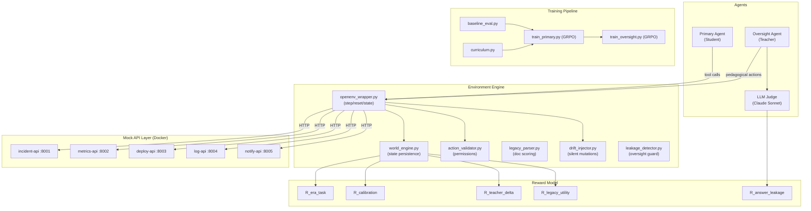

# EpistemicOps — Production-Ready Implementation Plan

> **Goal:** Build an RL training environment where an LLM gets measurably better at temporal uncertainty handling, generational knowledge transfer, and Socratic oversight — all within an enterprise SRE simulation.

---

## Architecture Summary



---

## User Review Required

> [!IMPORTANT]
> **LLM Judge API Key**: The spec calls for Claude Sonnet / GPT-4o as the LLM Judge. You will need an **Anthropic API key** or **OpenAI API key**. Which provider do you want to use, or both with fallback?

> [!IMPORTANT]
> **Docker requirement**: The mock API layer runs 5 FastAPI services + 1 drift injector in Docker containers. Confirm you have Docker Desktop installed and running on your machine.

> [!IMPORTANT]
> **GPU for Training**: The spec targets Llama 3.1 8B with Unsloth 4-bit quantization on a T4 GPU (Colab). Do you want the training pipeline runnable locally as well, or Colab-only?

> [!WARNING]
> **HuggingFace Spaces Deployment**: The demo uses Gradio on HF Spaces. Do you have a HuggingFace account and write token ready? The Spaces deployment requires a `HF_TOKEN` for pushing.

---

## Open Questions

> [!IMPORTANT]
> 1. **OpenEnv package**: The spec references "OpenEnv (latest release)". This appears to be a hackathon-specific framework. Do you have documentation or a PyPI link for it? If not, I'll implement a clean Gymnasium-style interface that matches the spec's `step()/reset()/state()` API and can be adapted later.

> [!IMPORTANT]
> 2. **Scope priority**: This is a massive project (~45 files). For the hackathon, should I prioritize:
>    - **(A)** Full end-to-end with Scenario 1 only (demo-ready fastest), or
>    - **(B)** All 3 scenarios + full training pipeline (complete but takes longer)?

> [!NOTE]
> 3. **Config/DB API**: The spec mentions `config-api` and `db-api` in the service table (Section 5.1) but they don't appear in the repository structure, docker-compose, or any scenario. I plan to skip them unless you want them included.

---

## Proposed Changes

The build is organized into **7 phases**, ordered by dependency (each phase unlocks the next). No phase can fail silently — every phase has concrete test criteria.

---

### Phase 1: Project Scaffolding & Dependencies

**Goal:** Repository structure, all configs, all dependencies — nothing runs yet, but everything is wired.

#### [NEW] [requirements.txt](file:///c:/Users/divya/Desktop/EpistemicOPS-Hf/EpistemicOps/requirements.txt)
Core Python dependencies:
```
fastapi>=0.104.0
uvicorn>=0.24.0
httpx>=0.25.0
pydantic>=2.5.0
pyyaml>=6.0.1
docker>=7.0.0
anthropic>=0.40.0
openai>=1.50.0
gradio>=4.0.0
torch>=2.1.0
transformers>=4.36.0
trl>=0.7.0
unsloth>=2024.1
datasets>=2.16.0
matplotlib>=3.8.0
numpy>=1.24.0
pytest>=7.4.0
pytest-asyncio>=0.23.0
tiktoken>=0.5.0
```

#### [NEW] [docker-compose.yml](file:///c:/Users/divya/Desktop/EpistemicOPS-Hf/EpistemicOps/docker-compose.yml)
Orchestration for 5 mock APIs + drift injector sidecar — exact copy from spec Section 19.1

#### [NEW] Full directory tree
Create every `__init__.py`, empty module stubs, and package markers:
```
epistemicops/
├── environment/
├── mock_apis/{incident,metrics,deploy,log,notify}_api/
├── scenarios/
├── agents/
├── reward/
├── training/
├── eval/
├── demo/
└── docs/
```

**Test:** `python -c "import environment; import agents; import reward"` succeeds

---

### Phase 2: Mock API Layer (Docker Services)

**Goal:** 5 fully functional FastAPI services with stable AND drifted modes, each with internal drift endpoint.

#### [NEW] mock_apis/incident_api/main.py
- `GET /incidents/{incident_id}` — stable: `status` as integer (0,1,2); drifted: `status` as string enum
- `POST /incidents/{incident_id}/resolve` — stable: 204 empty; drifted variants
- `POST /internal/drift` + `GET /internal/mode` — internal control endpoints
- Implements **DE-001** (status string drift) and **DE-006** (cascade partner)

#### [NEW] mock_apis/metrics_api/main.py
- `GET /metrics/service/{service_name}` — stable: `datapoints[].value`; drifted: `datapoints[].metric_value`
- Implements **DE-005** (field rename)

#### [NEW] mock_apis/deploy_api/main.py
- `POST /deployments/rollback` — stable: 200 with body; drifted: 204 empty body (DE-002)
- Auth header: stable `X-Deploy-Token`; drifted `Authorization: Bearer` (DE-004)

#### [NEW] mock_apis/log_api/main.py
- `GET /logs/query` — stable: offset pagination; drifted: cursor pagination (DE-008)

#### [NEW] mock_apis/notify_api/main.py
- `POST /notifications/send` — stable: `delivered: true`; drifted: `delivered: false` (DE-003)
- Rate limiting: stable 100/min; drifted 5/min (DE-007)

#### [NEW] Each service gets a Dockerfile
Based on spec template (Section 19.2)

**Test:** `docker-compose up` → all 5 services respond on ports 8001-8005 → hit stable endpoints → trigger drift via `/internal/drift` → verify drifted responses

---

### Phase 3: Environment Engine (Core Logic)

**Goal:** The brain of the system — OpenEnv-compliant wrapper that manages eras, phases, state, actions, and drift.

#### [NEW] environment/world_engine.py
- Complete world state object (Section 7.1) with JSON-serializable persistence
- Phase state machine: `AWAKENING → OPERATION → DRIFT_INJECTION → SOCRATIC_RECOVERY → LEGACY_GENERATION`
- Phase transition rules (Section 6)
- Service health tracking, incident history, deployment history, technical debt, team trust scores
- State persistence across eras; context wipe at era boundary
- Legacy document store management

#### [NEW] environment/action_validator.py
- Agent role → permitted actions mapping (Section 16.2)
- Payload schema validation per action type
- `PERMISSION_DENIED` error generation

#### [NEW] environment/drift_injector.py
- Drift event scheduler (reads scenario YAML drift_window config)
- HTTP calls to `POST /internal/drift` on target service containers
- Drift event library: all 8 pre-built events (DE-001 through DE-008)
- Cascade support (multiple simultaneous drifts)

#### [NEW] environment/legacy_parser.py
- Section header parser (validates 6 required sections)
- Token counting (tiktoken)
- Truncation enforcement (2048 token hard limit)
- Structural compliance scoring
- Drift capture rate scoring (compare doc against drift log)
- Trust calibration scoring (compare ratings to actual next-era outcomes)

#### [NEW] environment/leakage_detector.py
- Text analysis to detect answer leakage in Oversight Agent responses
- Keyword/semantic matching against drift event descriptions
- Severity classification (0.0, 0.3, 0.7, 1.0)
- Integrates with LLM judge for final leakage_severity score

#### [NEW] environment/openenv_wrapper.py
- `EpistemicOpsEnv` class implementing `reset()`, `step()`, `state()`, `render()`
- Coordinates all sub-engines (world_engine, drift_injector, action_validator, legacy_parser)
- Docker container lifecycle management
- Observation construction per agent role (information asymmetry enforcement)
- Token budget enforcement (6000 tokens per step)

**Test:** Unit tests for every component + integration test: `reset("cascading_incident", 1)` → step through Phase 1 → get valid observation

---

### Phase 4: Scenario Library & Agent Scaffolding

**Goal:** YAML scenario configs + LLM agent prompt templates that drive the whole system.

#### [NEW] scenarios/cascading_incident.yaml
Full 5-era scenario (Section 13, Scenario 1) with:
- Per-era task briefs, drift events, success criteria, max_steps
- Drift windows, legacy token budgets
- Service availability per era

#### [NEW] scenarios/deployment_disaster.yaml
Full 5-era scenario (Section 13, Scenario 2)

#### [NEW] scenarios/invisible_outage.yaml
5-era hard-mode scenario (Section 13, Scenario 3) — **held out for evaluation**

#### [NEW] agents/primary_agent.py
- System prompt template for Primary Agent (SRE role, tool usage, Legacy Doc writing)
- Action generation logic (prompt → JSON action)
- Reasoning trace capture (full CoT)
- Tool call formatting and response parsing
- Legacy Document generation with section schema compliance

#### [NEW] agents/oversight_agent.py
- System prompt template for Oversight Agent (pedagogical role, restraint rules)
- Intervention strategy selection (6 action types)
- Drift config awareness integration
- Primary Agent reasoning trace analysis
- Prior intervention history tracking for adaptation

#### [NEW] agents/llm_judge.py
- Judge system prompt (Section 15.1 — exact spec)
- Async invocation with 10-second timeout
- Response parsing with regex fallback
- 4-dimension scoring (targeting, restraint, calibration, adaptation)
- Leakage severity extraction

**Test:** Scenario YAML loads and validates → agent prompt generates valid actions → judge returns valid scores

---

### Phase 5: Reward Model

**Goal:** All 5 reward components implemented, tested, and composable.

#### [NEW] reward/era_task_reward.py
- `R_era_task`: Success criteria evaluation per scenario/era
- Criteria: incident_resolved, slo_breach_avoided, notifications_delivered, technical_debt_reduced, legacy_doc_written
- Range: 0.0 – 1.0

#### [NEW] reward/calibration_reward.py
- `R_calibration`: Confidence accuracy multiplier (0.5× – 1.5×)
- Tracks all `declare_hypothesis` actions and outcomes
- Brier score calculation
- Neutral (1.0×) when no hypotheses declared

#### [NEW] reward/teacher_delta_reward.py
- `R_teacher_delta`: Pre/post intervention score delta
- Normalized by max possible improvement
- Edge cases: clean run (0.5 bonus), self-recovery (0.3), no recovery (0.0)
- Divided by intervention count if >5 interventions

#### [NEW] reward/legacy_utility_reward.py
- `R_legacy_utility`: Counterfactual measurement (with doc vs. without doc)
- 5-episode averaging for statistical significance
- Bonus +0.2 for accurate trust predictions
- Penalty -0.1 per undocumented drift event
- Range: -0.5 – 1.0

#### [NEW] reward/leakage_penalty.py
- `R_answer_leakage`: Per-intervention penalty (0.0 to -1.0)
- Integrates LLM judge leakage_severity score
- Override rule: leakage_severity > 0.7 → intervention logged as FAILED

#### [NEW] reward/__init__.py
- `compute_total_reward()`: Combines all 5 components per spec formula
- `R_total = (R_era_task × R_calibration) + R_teacher_delta + R_legacy_utility + R_answer_leakage`

**Test:** Unit test each component with known inputs → verify exact reward values match spec example (Section 14.4)

---

### Phase 6: Training Pipeline

**Goal:** GRPO training with Unsloth, curriculum learning, baseline evaluation, Colab notebook.

#### [NEW] training/baseline_eval.py
- Run base Llama 3.1 8B Instruct zero-shot across all 3 scenarios
- Collect all reward components per era
- Generate baseline metrics: task completion, drift detection, legacy utility, calibration, socratic delta
- Save results as JSON + matplotlib plots

#### [NEW] training/train_primary.py
- GRPO training via HuggingFace TRL + Unsloth 4-bit quantization
- Delayed reward handling (`reward_delay_steps=5`)
- Curriculum schedule (Section 17.2):
  1. Scenario 1 only, 2 eras → until reward 0.5
  2. Scenarios 1+2, 3 eras → until reward 0.65
  3. All scenarios, 5 eras → until reward 0.75
- Checkpoint saving every 100 steps
- WandB/TensorBoard logging

#### [NEW] training/train_oversight.py
- Oversight Agent GRPO training with frozen Primary Agent
- Reward: `R_teacher_delta + judge_score + leakage_penalty`
- Same Unsloth setup, separate checkpoint directory

#### [NEW] training/curriculum.py
- Curriculum schedule logic with auto-advancement
- Reward threshold monitoring
- Scenario rotation

#### [NEW] training/colab_training.ipynb
- 12-cell self-contained notebook (Section 17.5)
- T4 GPU compatible
- Full install → baseline → train → evaluate → push to Hub pipeline

#### [NEW] eval/benchmark.py
- Held-out evaluation on Scenario 3 (Invisible Outage)
- Before/after comparison generation

#### [NEW] eval/metrics.py
- All metric computations (Section 21.1)
- Era completion rate, drift detection rate, legacy utility, calibration (Brier), socratic delta, leakage rate

#### [NEW] eval/counterfactual_runner.py
- Runs Era N+1 with and without Legacy Doc (5 episodes each)
- Reports mean, std, utility delta

**Test:** Baseline eval runs without error → training loop completes 1 epoch → checkpoint saved → eval runs on checkpoint

---

### Phase 7: Demo & Deployment

**Goal:** Gradio demo on HuggingFace Spaces + documentation.

#### [NEW] demo/app.py
- 3-panel Gradio interface (World State | Agent Actions | Reward Dashboard)
- 3 modes: Live, Replay, Before/After
- Real-time state updates during episode playback
- Service health indicators with drift detection markers
- Reward curve visualization (matplotlib embedded)

#### [NEW] demo/visualisations.py
- Reward curve plots (per-component and total)
- World state rendering
- Era timeline visualization
- Drift event markers on timeline

#### [NEW] demo/replay.py
- Episode recording and playback system
- JSON-serialized episode trajectories
- Step-by-step replay with timing

#### [NEW] docs/PROBLEM_STATEMENT.md
- Copy of epistemicOps.md (canonical reference)

#### [NEW] docs/BLOG_POST.md
- HuggingFace mini-blog (<300 words, <2 min read)

#### [NEW] docs/PITCH_DECK.md
- 3-minute pitch outline with speaker notes

#### [MODIFY] [README.md](file:///c:/Users/divya/Desktop/EpistemicOPS-Hf/EpistemicOps/README.md)
- 60-second judge orientation
- Quick start, architecture diagram, results summary, links

**Test:** `gradio demo/app.py` launches → all 3 modes functional → deploy to HF Spaces → live demo accessible

---

## Build Order & Dependencies

```mermaid
gantt
    title EpistemicOps Build Phases
    dateFormat X
    axisFormat %s

    section Phase 1
    Scaffolding & Deps          :p1, 0, 1

    section Phase 2
    Mock API Layer (Docker)     :p2, after p1, 2

    section Phase 3
    Environment Engine          :p3, after p1, 3

    section Phase 4
    Scenarios & Agents          :p4, after p2 p3, 2

    section Phase 5
    Reward Model                :p5, after p3, 2

    section Phase 6
    Training Pipeline           :p6, after p4 p5, 2

    section Phase 7
    Demo & Deployment           :p7, after p4 p5, 2
```



> Phases 2 & 3 run in parallel after Phase 1.  
> Phases 6 & 7 run in parallel after Phases 4 & 5.

---

## Verification Plan

### Automated Tests

Each phase has unit + integration tests:

```bash
# Phase 2: Mock APIs
pytest tests/test_mock_apis.py -v
# Verify all 5 services start, respond correctly in stable mode, switch to drifted mode

# Phase 3: Environment Engine
pytest tests/test_environment.py -v
# Verify world state, phase transitions, action validation, drift injection, legacy parsing

# Phase 4: Scenarios & Agents
pytest tests/test_scenarios.py -v
# Verify YAML loading, agent prompt generation, action parsing

# Phase 5: Reward Model
pytest tests/test_rewards.py -v
# Verify each component matches spec example (Section 14.4)

# Phase 6: Training Pipeline
pytest tests/test_training.py -v
# Verify baseline eval runs, training loop completes 1 step, checkpoint saves

# Full integration
pytest tests/test_integration.py -v
# Full scenario run: reset → 5 eras → rewards computed → Legacy Docs scored
```

### Manual Verification
- Docker services: `curl localhost:800{1-5}` after `docker-compose up`
- Demo: Launch Gradio, run all 3 modes, verify UI matches spec wireframe
- HF Spaces: Deploy and test publicly accessible URL
- Before/after: Visual comparison of base model vs. fine-tuned on same scenario

---

## Risk Assessment

| Risk | Likelihood | Impact | Mitigation |
|---|---|---|---|
| Docker not available on target machine | Medium | High | Provide non-Docker fallback (in-process FastAPI with TestClient) |
| LLM Judge API rate limits | Medium | Medium | Cache judge results, batch calls, implement timeout fallback scores |
| Unsloth compatibility issues | Medium | Medium | Fall back to standard HF transformers with bitsandbytes 4-bit |
| Delayed reward destabilizes GRPO | High | High | Start with immediate proxy rewards, gradually introduce delay |
| Legacy utility counterfactual is expensive | High | Medium | Reduce to 3 episodes, use cached base model runs |
| Colab T4 memory limits with 8B model | Medium | High | Unsloth 4-bit + gradient checkpointing + batch_size=1 with accumulation |

---

## File Count Summary

| Category | New Files | Modified Files |
|---|---|---|
| Config & Scaffolding | 8 | 2 |
| Mock APIs (5 services) | 15 | 0 |
| Environment Engine | 7 | 0 |
| Scenarios | 3 | 0 |
| Agents | 3 | 0 |
| Reward Model | 6 | 0 |
| Training Pipeline | 6 | 0 |
| Evaluation | 3 | 0 |
| Demo | 3 | 0 |
| Documentation | 3 | 0 |
| Tests | 6 | 0 |
| **Total** | **~63** | **2** |

---

*Ready to build on your approval. I'll start with Phase 1 and work through sequentially, testing each phase before moving to the next.*
